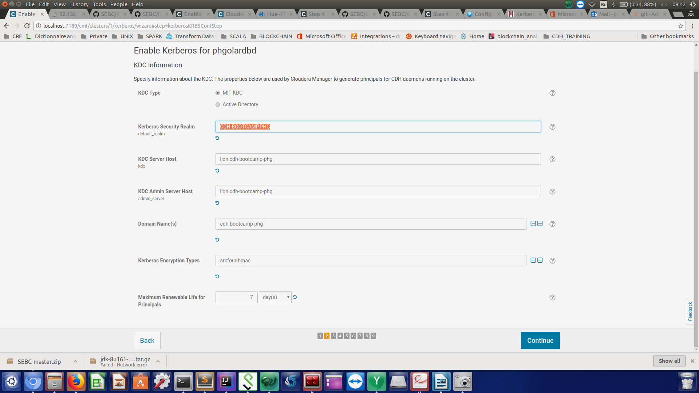

##pre requisite for the lab
content

A kerberos

B sentry
##A kerberos
####1 

```aidl
Before you start:

Load sample data for Hive/Impala
Login to HUE using your GitHub name and the password cloudera
The first login to Hue becomes the admin account
Follow the setup wizard to load sample tables for Hive and Impala
You'll need this data to support the Sentry lab

admin admin
phgolard
```

####2 Test if JCE is installed
https://blog.puneethabm.com/configure-hadoop-security-with-cloudera-manager-using-kerberos/

Test if JCE is installed
`nano Test.java`
```aidl
import javax.crypto.Cipher;

class Test {
  public static void main(String[] args) {
    try {
      System.out.println("Hello World!");
      int maxKeyLen = Cipher.getMaxAllowedKeyLength("AES");
      System.out.println(maxKeyLen);
    } catch (Exception e){
      System.out.println("Sad world :(");
    }
  }
}
```
```aidl
#!/bin/bash

javac Test.java
java Test
```

####3 Kerberos architecture - set up servers and clients
kerberos server setup : lion (CM server node)
`sudo yum -y install krb5-server krb5-libs krb5-auth-dialog krb5-workstation`
kerberos client setup : all nodes (including CM server)
`sudo yum -y install krb5-workstation krb5-libs krb5-auth-dialog`

####4 kerberos server configuration
```aidl
Server:
–> Change Realm Name > cdh-bootcamp-phg
–> Add parameters > max_life = 1d and max_renewable_life = 7d
```

`sudo nano /var/kerberos/krb5kdc/kdc.conf`
```aidl
[kdcdefaults]
 kdc_ports = 88
 kdc_tcp_ports = 88

[realms]
  CDH.BOOTCAMP.PHG = {
  #master_key_type = aes256-cts
  acl_file = /var/kerberos/krb5kdc/kadm5.acl
  dict_file = /usr/share/dict/words
  admin_keytab = /var/kerberos/krb5kdc/kadm5.keytab
  supported_enctypes = aes256-cts:normal aes128-cts:normal des3-hmac-sha1:normal arcfour-hmac:normal des-hmac-sha1:normal des-cbc-md5:normal des-cbc-crc:normal
  max_life = 1d
  max_renewable_life = 7d
 }
```

####5 kerberos client (all nodes)

`sudo nano /etc/krb5.conf`

```aidl
[logging]
 default = FILE:/var/log/krb5libs.log
 kdc = FILE:/var/log/krb5kdc.log
 admin_server = FILE:/var/log/kadmind.log

[libdefaults]
 default_realm = CDH.BOOTCAMP.PHG
 dns_lookup_realm = false
 dns_lookup_kdc = false
 ticket_lifetime = 24h
 renew_lifetime = 7d
 forwardable = true
 udp_preference_limit = 1
 default_tgs_enctypes = arcfour-hmac
 default_tkt_enctypes = arcfour-hmac 

[realms] 
  CDH.BOOTCAMP.PHG = {
  kdc = lion.cdh-bootcamp-phg
  admin_server = lion.cdh-bootcamp-phg
 }

[domain_realm]
   .cdh-bootcamp-phg = CDH.BOOTCAMP.PHG
   cdh-bootcamp-phg = CDH.BOOTCAMP.PHG
```

####6 Kerberos server - Create the database using the kdb5_util utility
`sudo /usr/sbin/kdb5_util create -s`

```aidl
 database master key : K/M@CDH.BOOTCAMP.PHG
 (actually this is a password)
```

####7 Kerberos server - add cloudera-scm principal, it will be used by Cloudera Manager later to manage Hadoop principals
principal = user
`kadmin.local`
```aidl
kadmin.local:  addprinc cloudera-scm@CDH.BOOTCAMP.PHG
WARNING: no policy specified for cloudera-scm@PUNEETHA.COM; defaulting to no policy
Enter password for principal "cloudera-scm@PUNEETHA.COM": admin
Re-enter password for principal "cloudera-scm@PUNEETHA.COM": admin
Principal "cloudera-scm@CDH.BOOTCAMP.PHG" created.

```
####8 Kerberos server : Add */admin and cloudera-scm to ACL(Access Control List), which gives privilege to add principals for admin and cloudera-scm principal
      
`sudo nano /var/kerberos/krb5kdc/kadm5.acl`
```aidl
*/admin@CDH.BOOTCAMP.PHG *
cloudera-scm@CDH.BOOTCAMP.PHG admilc
```

####9 kerberos server : password policy
`kadmin.local`
```aidl
kadmin.local:  addpol admin
kadmin.local:  addpol users
kadmin.local:  addpol hosts
kadmin.local:  exit
```

####10 Create a file called cmf.principal and add cloudera principal name in that file as shown below and provide appropriate permissions:

`sudo nano /etc/cloudera-scm-server/cmf.principal`
```
cloudera-scm@CDH.BOOTCAMP.PHG
```

`sudo chown cloudera-scm:cloudera-scm /etc/cloudera-scm-server/cmf.principal`

`sudo chmod 600 /etc/cloudera-scm-server/cmf.principal`

#####11 on 1 node  which haskerberos clients, afterwards, do a kinit for your cloudera manager principal and look at the content of the kinit file (important is the FRI property that stands for Forwardable, Renewable and I...)

on 1 node (as long this node has a kerberos client setup, since the kinit enables you to get the ticket that will enable you to interact with the services)

`kinit cloudera-scm`


`klist -e -f`
```aidl
Ticket cache: FILE:/tmp/krb5cc_1000
Default principal: cloudera-scm@CDH.BOOTCAMP.PHG

Valid starting       Expires              Service principal
2018-03-14 16:37:00  2018-03-15 16:37:00  krbtgt/CDH.BOOTCAMP.PHG@CDH.BOOTCAMP.PHG
	renew until 2018-03-21 16:37:00, Flags: FRI
	Etype (skey, tkt): arcfour-hmac, aes256-cts-hmac-sha1-96
```

####11 Start Kerberos using the following commands:

`sudo service krb5kdc start`

`service kadmin start`

####12 cloudera doc to enable kerberos through CM wizzard
https://www.cloudera.com/documentation/enterprise/latest/topics/cm_sg_s4_kerb_wizard.html
but most of the steps have been executed at this stage so just install the 
`sudo yum install openldap-clients`

######12.1 go to cloudera manager UI and enable kerberos
cluster name < Actions

######12.2Enable Kerberos
KDC Information (page on the HUI - please fill in with appropriate info according to what you filled in the previous steps
<p align="center">
  
</p>


- kdc MIT
- kdc sec realm : CDH.BOOTCAMP.PHG
- kdc admin server host : lion.cdh-bootcamp-phg
- domain cdh-bootcamp-phg
- encryption type (see the value in your klist)
######12.3KRB5 Configuration
do not let overwrite the krb5.conf file if you've deployed it on your cluster (I did do it so make sure the check box is unchecked)
######12.4Enable Kerberos for cluster phgolardbd

uname cloudera-scm@CDH.BOOTCAMP.PHG
pword admin

######12.5 Kerberos Principal
Specify the Kerberos principal used by each service in the cluster. Additional steps may be required if you decide to change these principals from their default values. Please read the documentation about custom principals before making changes on this page.

go ahead with the users the wizard will propose you by default for all the service as all principals are also the unix users of those services

#####13 Create the HDFS Superuser
To be able to create home directories for users, you will need access to the HDFS superuser account. (CDH automatically created the HDFS superuser account on each cluster host during CDH installation.) When you enabled Kerberos for the HDFS service, you lost access to the default HDFS superuser account using sudo -u hdfs commands. Cloudera recommends you use a different user account as the superuser, not the default hdfs account.

######13.1Designating a Non-Default Superuser Group
To designate a different group of superusers instead of using the default hdfs account, follow these steps:
ATTENTION the group has to exist as a UNIX group !!!
```aidl
Go to the Cloudera Manager Admin Console and navigate to the HDFS service.
Click the Configuration tab.
```

```aidl
Select Scope > HDFS (Service-Wide).
Select Category > Security.
Locate the Superuser Group property and change the value to the appropriate group name for your environment. 

here I chose the group 

hdfs

Click Save Changes to commit the changes.
Restart the HDFS service.
To enable your access to the superuser account now that Kerberos is enabled, you must now create a Kerberos principal or an Active Directory user whose first component is <superuser>:

```

#######If you are using Active Directory
#########Add a new user account to Active Directory, <superuser>@YOUR-REALM.COM. The password for this account should be set to never expire.

#######13.2 kerberos server - add the hdfs superuser principal
In the kadmin.local or kadmin shell, type the following command to create a Kerberos principal called <superuser>:

`sudo kadmin.local`

`addprinc hdfs@CDH.BOOTCAMP.PHG`

This command prompts you to create a password for the <superuser> principal. You should use a strong password because having access to this principal provides superuser access to all of the files in HDFS.
To run commands as the HDFS superuser, you must obtain Kerberos credentials for the <superuser> principal. To do so, run the following command and provide the appropriate password when prompted.
`kinit hdfs@YOUR-LOCAL-REALM.COM`
```aidl
hdfs super user password:
hdfs
```

#######13.4 from 1 kerberos client do a kinit
`kinit hdfs`

#####14 Get or Create a Kerberos Principal for Each User Account

Now that Kerberos is configured and enabled on your cluster, you and every other Hadoop user must have a Kerberos principal or keytab to obtain Kerberos credentials to be allowed to access the cluster and use the Hadoop services. In the next step of this procedure, you will need to create your own Kerberos principals to verify that Kerberos security is working on your cluster. If you and the other Hadoop users already have a Kerberos principal or keytab, or if your Kerberos administrator can provide them, you can skip ahead to the next step.

The following instructions explain how to create a Kerberos principal for a user account.

If you are using Active Directory
Add a new AD user account for each new user that should have access to the cluster. You do not need to make any changes to existing user accounts.

If you are using MIT KDC
In the kadmin.local or kadmin shell, use the following command to create user principals by replacing YOUR-LOCAL-REALM.COM with the name of your realm, and replacing USERNAME with a username:
`kadmin.local`

`addprinc phgolardbd@CDH.BOOTCAMP.PHG `
```aidl
enter password for the user phgolardb

password
```

######15 testing the kinit with your users
go to a terminal
do a kinit phgolardbd
type your password
then do a hdfs dfs -ls


testing 
https://www.cloudera.com/documentation/enterprise/latest/topics/cm_sg_s8_verify_kerb.html

##B Sentry

####1 install sentry using the wizard


###2 pre steps before enabling service
Note on hdfs gateways
you can assign all nodes gateway roles as it only passes them hdfs config files

Notes on kerberos keytabs


```aidl
with a key tab
ktutil
ktutil:  add_entry -password -p hdfs@CDH.BOOTCAMP.PHG -k 1 -e arcfour-hmac
Password for hdfs@CDH.BOOTCAMP.PHG: 
ktutil:  wkt hdfs.keytab

kinit -kt hdfs.keytab hdfs@CDH.BOOTCAMP.PHG
sudo -u hdfs kinit -kt hdfs.keytab hdfs
```


if you have already not set up kerberos
sudo -u hdfs hdfs dfs -chmod -R 771 /user/hive/warehouse
sudo -u hdfs hdfs dfs -chown -R hive:hive /user/hive/warehouse

if you have already set up kerberos


###3 pre enablement

https://www.cloudera.com/documentation/enterprise/latest/topics/sg_sentry_service_config.html#concept_z5b_42s_p4

Go to the Hive service.
Click the Configuration tab.
Select Scope > HiveServer2.
Select Category > Main.
Uncheck the HiveServer2 Enable Impersonation checkbox.
Click Save Changes to commit the changes.

If you are using YARN, enable the Hive user to submit YARN jobs.
Open the Cloudera Manager Admin Console and go to the YARN service.
Click the Configuration tab.
Select Scope > NodeManager.
Select Category > Security.
Ensure the Allowed System Users property includes the hive user. If not, add hive.
Click Save Changes to commit the changes.
Repeat steps 1-6 for every NodeManager role group for the YARN service that is associated with Hive.
Restart the YARN service.
Block the Hive CLI user from accessing the Hive metastore:

In the Cloudera Manager Admin Console, select the Hive service.
On the Hive service page, click the Configuration tab.
In the search field, search for Hive Metastore Access Control and Proxy User Groups Override to locate the hadoop.proxyuser.hive.groups setting.
Click the plus sign three times to add the following groups:
hive
hue
sentry
Click Save Changes.

###4 service enablement

Enabling the Sentry Service for Hive
Go to the Hive service.
Click the Configuration tab.
Select Scope > Hive (Service-Wide).
Select Category > Main.
Locate the Sentry Service property and select Sentry.
Locate the Enable Stored Notifications in Database property and select it.
Click Save Changes to commit the changes.
Restart the Hive service.
Enabling Sentry on Hive service places several HiveServer2 properties on a restricted list properties that cannot be modified at runtime by clients. See HiveServer2 Restricted Properties.
Enabling the Sentry Service for Impala
Enable the Sentry service for Hive (as instructed above).
Go to the Impala service.
Click the Configuration tab.
Select Scope > Impala (Service-Wide).
Select Category > Main.
Locate the Sentry Service property and select Sentry.
Click Save Changes to commit the changes.
Restart Impala.
Enabling the Sentry Service for Solr
Enable the Sentry service as follows:
Go to the Solr service.
Click the Configuration tab.
Select Scope > Solr (Service-Wide).
Select Category > Main.
Locate the Sentry Service property and select Sentry.
Click Save Changes to commit the changes.
Restart Solr.
After enabling Sentry for Solr, you may want to configure authorization as described in Configuring Sentry Authorization for Cloudera Search.

Enabling the Sentry Service for Hue
Hue uses a Security app to make it easier to interact with Sentry. When you set up Hue to manage Sentry permissions, make sure that users and groups are set up correctly. Every Hue user connecting to Sentry must have an equivalent OS-level user account on all hosts so that Sentry can authenticate Hue users. Each OS-level user should also be part of an OS-level group with the same name as the corresponding user's group in Hue.

For more information on using the Security app, see the related blog post.

Enable the Sentry service as follows:
Enable the Sentry service for Hive and Impala (as instructed above).
Go to the Hue service.
Click the Configuration tab.
Select Scope > Hue (Service-Wide).
Select Category > Main.
Locate the Sentry Service property and select Sentry.
Click Save Changes to commit the changes.
Restart Hue.
Add the Hive, Impala and Hue Groups to Sentry's Admin Groups
Go to the Sentry service.
Click the Configuration tab.
Select Scope > Sentry (Service-Wide).
Select Category > Main.
Locate the Admin Groups property and add the hive, impala and hue groups to the list. If an end user is in one of these admin groups, that user has administrative privileges on the Sentry Server.
Click Save Changes to commit the changes.


###5 Testing class - 
This tutorial assumes:
Your cluster has been Kerberized
######5.1 Configure Sentry to recognize your test account as an administrator
Add your test user's primary group to the sentry.service.admin.group list in CM
```aidl
go to Cm console
sentry > configuration > (scope) sentry (service wide) & main (category)

as my test user is phgolardbd, which primary group is phgolardbd, I add phgolardbd 
so that my user have admin rights on sentry

```

Restart Sentry, Hue, Hive, and Impala services
It should not be necessary to restart HDFS or YARN
#####5.2 Verify user privileges
Authenticate your user as a Kerberos principal

`kinit phgolardbd`

Use beeline to confirm your principal sees no tables

`beeline`

`!connect jdbc:hive2://localhost:10000/default;principal=hive/elephant.cdh-bootcamp-phg@CDH.BOOTCAMP.PHG`

```aidl
then you're connected to hive and are under the default database
please note that you do not need to do a kinit for the hive user as principal service users (except hdfs for hdsf comands)
authentifications is handled by CM (see the kerberos set up where you had to specifiy those users' lists)

please also note that elephant.cdh-bootcamp-phg is the fully qualified domain name of the node that handles hive metastore role

```


!connect jdbc:hive2://localhost:10000/default;principal=hive/fdqn@REALM.COM
Replace fqdn with your host's fully-qualified domain name
Use your Linux account/password to authenticate when prompted
Enter SHOW TABLES;
The statement should return an empty set because no authorizations are in place
Copy the transcript of this section to security/labs/sentry-test.md
Create a Sentry role with full authorization
In beeline:
CREATE ROLE sentry_admin;
GRANT ALL ON SERVER server1 TO ROLE sentry_admin;
GRANT ROLE sentry_admin TO GROUP {your_primary};
SHOW TABLES;
The statement should now return all tables
Create additional test users
Add new users to all cluster nodes
$ sudo groupadd selector
$ sudo groupadd inserters
$ sudo useradd -u 1100 -g selector george
$ sudo useradd -u 1200 -g inserters ferdinand
$ kadmin.local: add_principal george
$ kadmin.local: add_principal ferdinand
Create test roles
Login to beeline as your admin user
CREATE ROLE reads;
CREATE ROLE writes;
Grant read privilege for all tables to reads
GRANT SELECT ON DATABASE default TO ROLE reads;
GRANT ROLE reads TO GROUP selector;
Grant INSERT privilege for default.sample07 to 'writes':
REVOKE ALL ON DATABASE default FROM ROLE writes;
GRANT INSERT ON default.sample_07 TO ROLE writes;
GRANT ROLE writes TO GROUP inserters;
kinit as george, then login to beeline
kinit as george, login to beeline, and use SHOW TABLES;
george should be able to see all tables
Repeat the process as ferdinand
ferdinand should see sample_07
Add the transcripts of these sessions to security/labs/sentry-test.md
© 2018 GitHub, Inc.